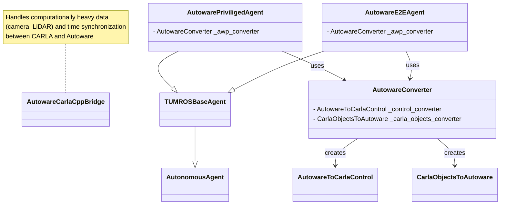
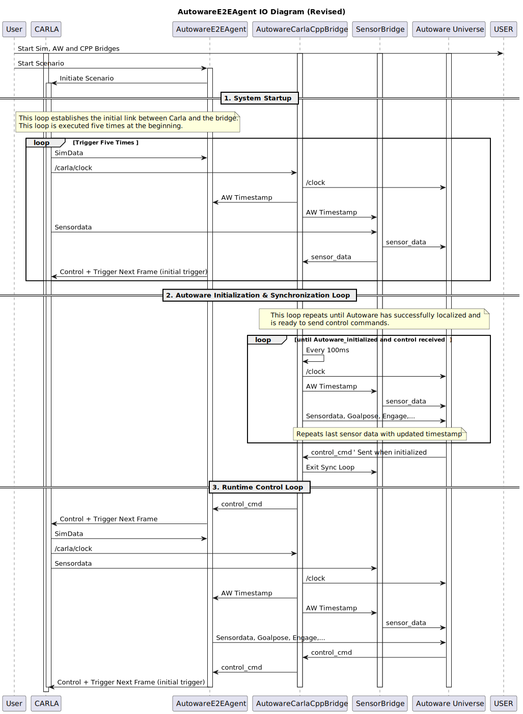

# Design

## Autoware Agents

There are two Autoware agents — `aw_e2e.py` and `aw_privileged.py` — which send slightly modified information from the simulator to Autoware.  

The **E2E mode** uses raw sensor data from the simulator, while the **Privileged mode** uses ground-truth localization and object information instead. Since the simulator does not provide ground-truth prediction data, a **bicycle model prediction** is used, which is map-independent.

## Class Diagram

## Flow Diagram

The following flowchart illustrates the data flow within the framework.
The **AutowareE2EAgent** orchestrates the entire scenario, acting as a bridge to the **CARLA Scenario Runner**, and serves as the primary data interface between **CARLA** and **Autoware**.

The **AutowareCarlaCPPBridge**, introduced in **CARLA 0.9.16**, leverages CARLA’s **native ROS 2 DDS** interface to handle camera and LiDAR data. Additionally, Autoware time is continuously tracked within the **AutowareCarlaCPPBridge**, allowing multiple scenarios to be executed consecutively in Autoware without requiring a restart—since CARLA time resets to zero at the beginning of each new scenario.

### Changes to CARLA
- Rename /clock to /carla/clock
- Rename /tf to /carla/f
- Reposition Traffic Light BBoxes see this https://github.com/carla-simulator/carla/issues/9445
